# PDF 图纸审批系统使用说明书

适用版本：`0.9.2`
适用环境：公司局域网、Windows 客户端、Windows 服务端
适用对象：设计师、主管、工艺、管理员

本文用于团队正式使用前培训和日常查阅。截图使用演示数据生成，实际项目名、图号、账号和服务器地址以公司现场配置为准。

## 1. 系统用途

PDF 图纸审批系统用于替代“导出 PDF -> 打印 -> 主管/工艺纸面审核 -> 返工重打”的流程。

系统当前主流程是：

1. 设计师在客户端上传 PDF 图纸。
2. 设计师确认项目、零件名、版本和三个签名框位置。
3. 主管和工艺并行审核。
4. 两人都通过后，系统自动生成带设计、主管、工艺手写签名的签后 PDF。
5. 设计师打开签后 PDF 打印，并标记打印归档。
6. 管理员负责目录、用户、模板、日志、备份、更新和异常处理。

系统只做公司内部可视手写签名盖章，不是 CA 证书数字签名。

## 2. 角色与权限

| 角色 | 主要入口 | 能做什么 | 不能做什么 |
| --- | --- | --- | --- |
| 设计师 | 提交图纸、全部图纸、我的签名、我的资料 | 上传图纸、放置签名框、查看状态、处理批注、重新生成签后 PDF、打印归档 | 不参与主管/工艺审核，不管理系统配置 |
| 主管 | 待我审核、全部图纸、我的签名、我的资料 | 查看待审、批注图纸、评论、通过或驳回 | 不提交图纸，不做系统维护 |
| 工艺 | 待我审核、全部图纸、我的签名、我的资料 | 从工艺角度审核、批注、评论、通过或驳回 | 不提交图纸，不做系统维护 |
| 管理员 | 系统管理、全部图纸、我的资料 | 配目录、管用户、管模板、看日志、备份、更新、删除图纸、处理异常 | 不负责日常上传图纸，不需要配置个人签名 |

主管和工艺是并行审核：任意一方可以先审，只有两方都通过后才会进入自动签名和待打印。

## 3. 首次使用准备

### 3.1 安装客户端

管理员会分发客户端安装包，例如：

```text
PDF图纸审批客户端-安装包-0.9.2.exe
```

双击安装后，从桌面或开始菜单打开 `PDF 图纸审批`。

如果 Windows 弹出安全提醒，确认安装包来自公司内部后继续安装。

### 3.2 连接审批服务器

客户端首次启动需要填写审批服务器地址。地址由管理员提供，通常类似：

```text
http://192.168.0.62:8080
```

注意：

- 不要把 `http://127.0.0.1:8080` 发给同事，这个地址只代表当前电脑自己。
- 同事电脑应使用服务端窗口显示的真实局域网 IP 地址。
- 如果连接失败，先点登录页或连接页里的“连接自检”。

### 3.3 登录、注册和找回密码

登录页如下：

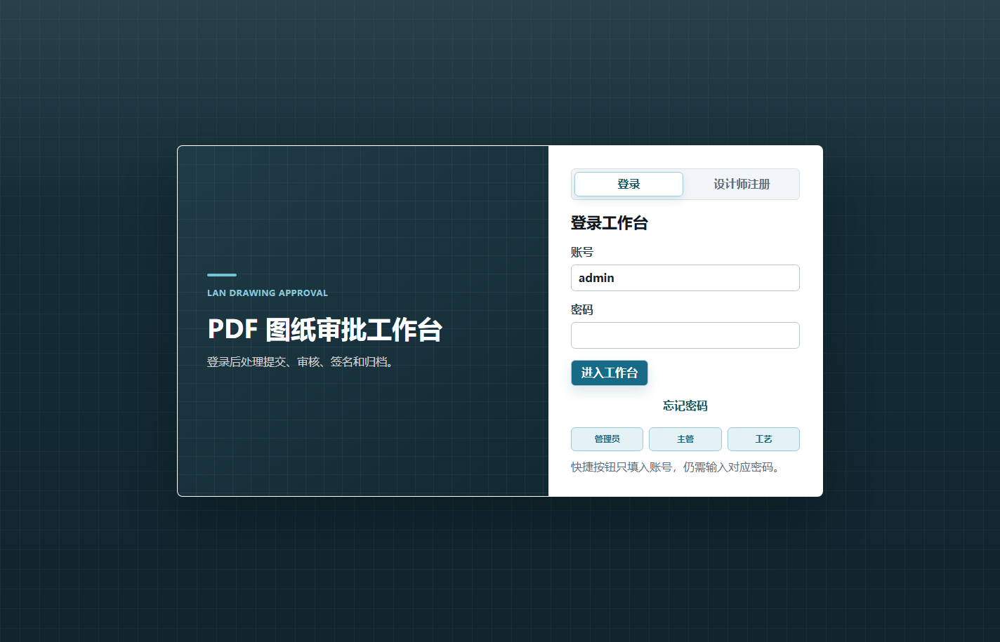

常用操作：

- 已有账号：输入用户名和密码登录。
- 设计师自助注册：点击注册入口，按页面提示填写账号、姓名、密码和邮箱。
- 忘记密码：点击找回密码，输入账号和邮箱；系统会通过已配置的 SMTP 邮件发送重置链接。
- 快捷登录按钮：只会帮你填入用户名，密码仍需要自己输入。

首次上线时可能存在默认账号，管理员应在系统启用前修改默认密码。

### 3.4 个人资料

所有普通用户都应维护个人资料：

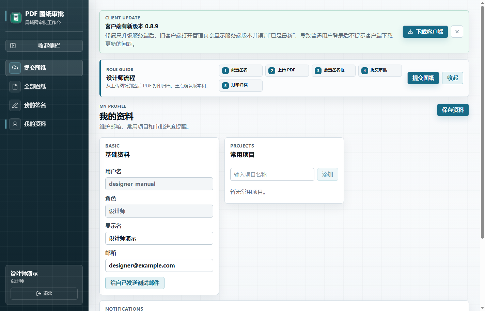

建议填写：

- 显示姓名：用于审批记录和通知。
- 邮箱：用于审核提醒、驳回提醒、密码重置和测试邮件。
- 常用项目：设计师、主管、工艺可填写，便于日常筛选和提交。
- 通知偏好：按角色选择需要接收的邮件提醒。
- 测试邮件：保存邮箱后，可给自己发送测试邮件确认通知可用。

管理员不需要常用项目，也不需要个人签名。

## 4. 文件命名和版本规则

上传 PDF 时建议使用：

```text
零件名-a0A0.pdf
```

示例：

```text
支架-a0A0.pdf
支架-a1A0.pdf
```

约定：

- `零件名`：尽量与图纸标题栏一致。
- `a0A0`：版本号；小版本变动通常类似 `a1A0`。
- 同项目、同零件、同版本不能重复提交。
- 系统会从文件名尝试解析零件名和版本，但提交前仍要人工确认。

## 5. 设计师使用说明

### 5.1 首次必须配置签名

设计师提交图纸前必须先配置自己的手写签名，否则后续自动生成签后 PDF 会失败。

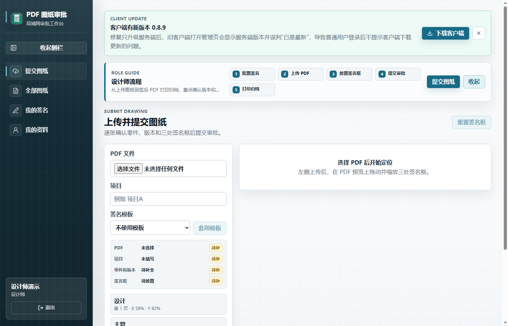

操作步骤：

1. 登录设计师账号。
2. 进入“我的签名”。
3. 选择一种方式：
   - 上传 PNG 签名图片。
   - 在手写板区域用鼠标、触控板或触摸屏手写。
4. 保存签名。
5. 确认页面出现当前签名预览。

签名建议：

- 使用深色笔迹。
- 推荐透明背景 PNG。
- 尽量只保留签名主体，不要上传整页扫描件。
- 签名太大或留白太多，会影响图框签字栏效果。

### 5.2 上传图纸

设计师首页通常是“提交图纸”：

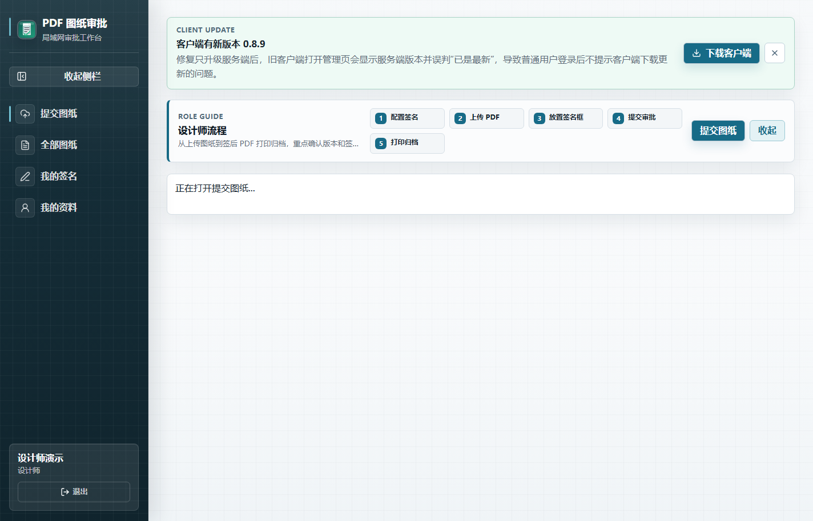

操作步骤：

1. 点击“提交图纸”。
2. 选择一个或多个 PDF。
3. 检查项目名、零件名、版本。
4. 如页面提示已有历史版本，确认本次版本是否正确。
5. 需要时选择签名模板作为初始位置。
6. 在 PDF 预览上放置三个签名框：
   - 设计
   - 主管
   - 工艺
7. 拖动签名框到标题栏签字位置。
8. 调整签名框大小，确认不会遮挡图纸内容。
9. 批量上传时，逐张切换图纸并检查每张签名框位置。
10. 点击提交审批。

提交成功后，系统会把 PDF 写入服务器设置的审批根目录，并进入主管和工艺并行审核。

### 5.3 批量上传注意事项

批量上传不是“第一张设置好后全部自动正确”。不同图纸的标题栏位置可能不同，所以必须逐张确认。

规则：

- 每张 PDF 独立保存项目、零件名、版本和签名框位置。
- 批量套用模板只适合作为初始位置。
- “套用到当前图纸”只影响当前正在看的图纸。
- 某一张失败不会阻止其它图纸提交。
- 文件名异常、PDF 无效、版本重复、缺少签名框都会导致单项失败。

### 5.4 PDF 预览操作

在提交、签名定位和详情页中，PDF 预览支持：

- 放大、缩小、适宽显示。
- 拖动平移。
- 上一页、下一页、页码跳转。
- 缩略页导航。
- 在 PDF 上拖拽签名框或查看批注位置。

建议使用页面工具栏里的缩放按钮，不要用浏览器或系统的页面缩放代替 PDF 缩放。

### 5.5 查看图纸状态

设计师可进入“全部图纸”查看自己提交过的图纸和处理状态：

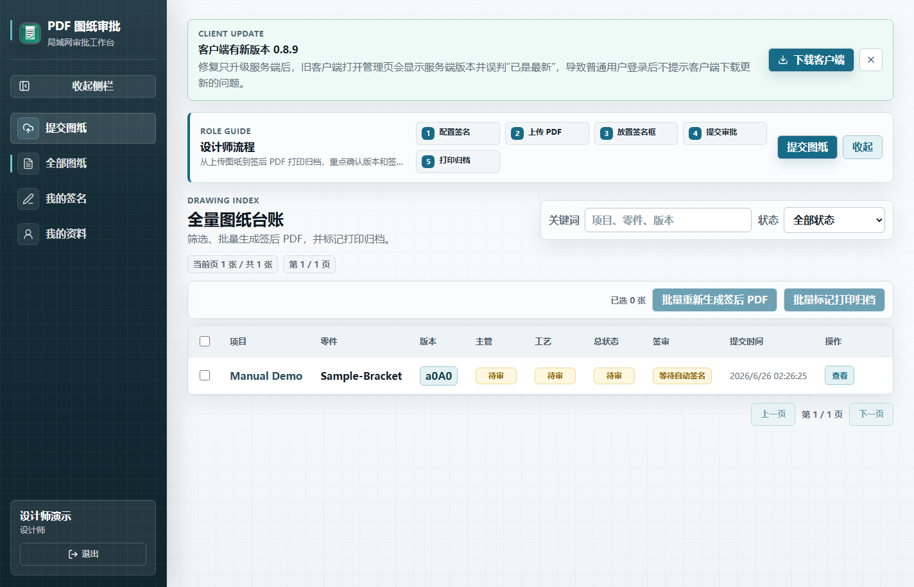

常见状态：

- 待审核：主管或工艺尚未全部完成审核。
- 已驳回：需要查看原因并重新出图。
- 已通过待打印：两方都通过，系统正在或已经生成签后 PDF。
- 签名失败：需要查看失败原因，通常是签名、签名框或文件状态问题。
- 已打印归档：已完成打印并归档。
- PDF 无效 / 文件丢失：需要联系管理员处理。

### 5.6 处理审核批注

主管或工艺可能会在图纸上添加批注。设计师可以：

- 打开审批详情查看批注。
- 点击批注列表定位到图纸位置。
- 根据问题修改设计。
- 将已处理的问题标记为完成。

设计师不能新增主管/工艺审核批注。

### 5.7 重新生成签后 PDF

如果图纸已经通过，但发现签名位置不合适，设计师可以在详情页调整签名框，然后点击“重新生成签后 PDF”。

适用场景：

- 签名位置偏了。
- 签名框太大或太小。
- 某个用户重新配置了更合适的签名图片。
- 签后 PDF 生成失败后已经补齐签名或签名框。

重新生成会生成新签后文件，不覆盖原审批 PDF。

### 5.8 打印归档

图纸状态为“已通过待打印”且签后 PDF 已生成后：

1. 打开审批详情。
2. 点击“打印并归档”。
3. 在打印设置中选择打印机、份数、打印范围、纸张、方向、颜色、双面、边距、缩放等参数。
4. 需要时点击“预览签后 PDF”，检查三方签名位置。
5. 确认后提交打印。
6. Windows 打印回调成功后，系统自动标记打印归档。

打印归档由设计师执行，不再设置单独打印角色。

浏览器访问时不能调用客户端原生打印参数。此时先点击“打开签后 PDF”完成打印，再回到系统点击“标记打印归档”。

系统能确认打印任务已提交给 Windows，但无法判断打印机后续是否缺纸、卡纸或实际出纸。如果打印取消或失败，系统不会自动归档。

## 6. 主管使用说明

### 6.1 查看待审核

主管登录后默认进入“待我审核”：

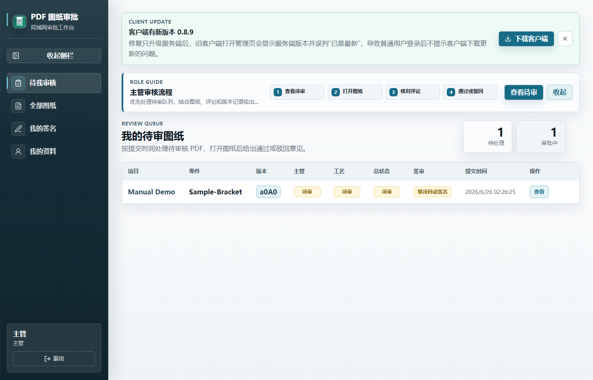

处理建议：

1. 先处理待审队列中的新图纸。
2. 按项目、零件名、版本核对本次提交。
3. 打开详情页查看 PDF、历史版本、协同记录和时间线。

### 6.2 审核图纸

审批详情页如下：

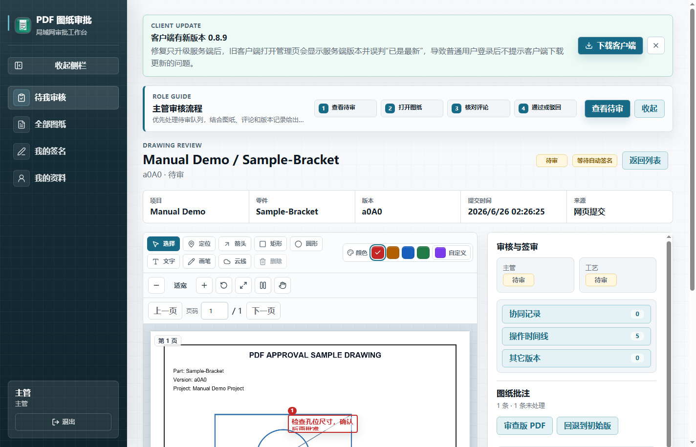

主管主要检查：

- 结构、尺寸、材料、技术要求是否满足设计意图。
- 标题栏项目、零件名、版本是否正确。
- 本次变更是否清晰。
- 签名框是否放在正确位置。
- 是否需要设计师修改。

审核操作：

- 通过：图纸无问题时点击通过。
- 驳回：有问题时填写明确原因后驳回。
- 评论：对沟通事项添加文字说明。
- 批注：在图纸上直接标出问题位置。

### 6.3 图纸批注

主管可以使用批注工具：

- 定位
- 箭头
- 矩形
- 圆形
- 文字
- 画笔
- 云线

使用建议：

- 优先在图纸上标出位置，再写简短问题说明。
- 颜色用于区分问题类型或重点程度。
- 修改建议应写清楚，不要只写“有问题”。
- 需要归档问题时，可生成“审查版 PDF”。

“审查版 PDF”包含批注，适合问题归档；“签后 PDF”只包含正式签名，不包含审核批注。

### 6.4 审核结论

主管审核通过后，系统仍会等待工艺审核。只有主管和工艺都通过，系统才会自动生成签后 PDF。

如果主管驳回，设计师需要按驳回原因修改后重新提交新版本。

## 7. 工艺使用说明

工艺账号的入口和主管类似，也是“待我审核”和详情页：


工艺重点检查：

- 加工方式是否可行。
- 材料、热处理、表面处理要求是否合理。
- 尺寸、公差、形位公差是否满足加工和检测条件。
- 图纸技术要求是否清晰。
- 版本变化是否影响工艺路线。

工艺可执行：

- 图纸批注。
- 评论沟通。
- 通过。
- 驳回。
- 查看历史版本和操作时间线。

工艺审核与主管审核并行，顺序不固定。

## 8. 管理员使用说明

管理员专注于运维管理，不负责日常上传图纸，也不需要配置个人签名。

### 8.1 系统管理总览

管理员登录后默认进入“系统管理”：

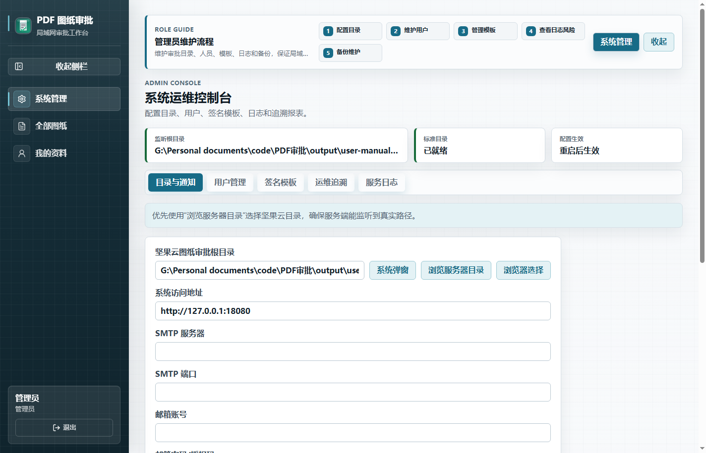

常用标签：

- 目录与通知
- 用户管理
- 签名模板
- 运维追溯
- 服务日志

### 8.2 目录与通知

管理员需要配置审批根目录。推荐使用坚果云同步目录，例如：

```text
E:\Nutstore\图纸审批
```

标准目录通常包括：

```text
01-待提交
02-审批中
03-已驳回
04-已通过待打印
05-已打印归档
```

操作步骤：

1. 在“目录与通知”设置审批根目录。
2. 优先使用“浏览服务器目录”选择真实服务器路径。
3. 点击“创建标准目录”。
4. 保存配置。
5. 点击“重启服务”，让监听目录生效。
6. 点击“立即重新扫描”，确认文件监听正常。

网页上传会把文件写入服务端设置的审批根目录。普通同事不需要直接访问该目录；只有使用文件夹投递、坚果云同步或管理员排障时，才需要关心目录路径。

邮件通知设置：

- 配置 SMTP 服务器、端口、邮箱账号和授权码。
- 配置主管、工艺或相关通知收件人。
- 点击测试邮件确认可用。
- 不要把邮箱授权码截图发给普通用户。

### 8.3 用户管理

用户管理页如下：

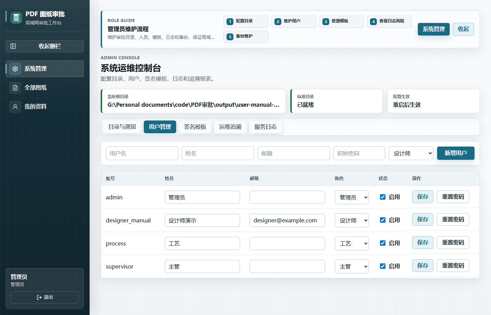

管理员可维护：

- 新建设计师、主管、工艺、管理员账号。
- 修改显示名称、角色、邮箱和启用状态。
- 重置用户密码。
- 禁用离职或不再使用的账号。

建议：

- 系统上线前修改默认账号密码。
- 每个人使用独立账号，不共用审核账号。
- 主管和工艺固定为当前实际审核人。
- 旧打印角色已不再用于新流程。

### 8.4 签名模板

签名模板用于复用常见图框位置。模板只保存位置，不保存任何人的签名图片。

适用场景：

- 团队经常使用同一种图框。
- 设计、主管、工艺签字栏位置固定。
- 批量上传时想快速初始化签名框。

注意：

- 模板修改不会自动改动已提交图纸。
- 套用模板后仍要逐张检查。
- 不同图框建议建立不同模板。

### 8.5 运维追溯

运维追溯页用于查看系统健康、更新、备份、批量任务和风险：

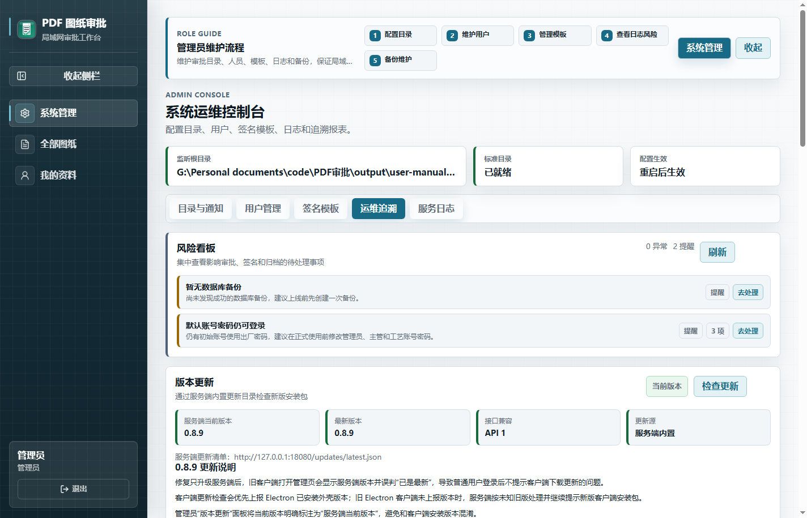

管理员日常建议检查：

- 风险看板是否有异常。
- 审批根目录是否存在。
- 标准目录是否齐全。
- 写入权限是否正常。
- 最近扫描是否成功。
- 最近备份是否成功。
- 是否存在签名失败图纸。
- 设计师、主管、工艺是否已配置签名。
- 是否有客户端或服务端更新。

备份建议：

- 正式启用前手动备份一次。
- 每天或每周定期备份数据库。
- 服务端升级前必须备份。
- 恢复数据库前确认当前业务是否暂停，避免覆盖新数据。

更新说明：

- 服务端会暴露局域网更新目录。
- 普通用户登录客户端后会自动检查客户端新版本。
- 管理员可以在版本更新面板查看客户端和服务端安装包。
- 当前系统只检查和下载安装包，不会静默自动覆盖安装。

### 8.6 服务日志

服务日志页如下：

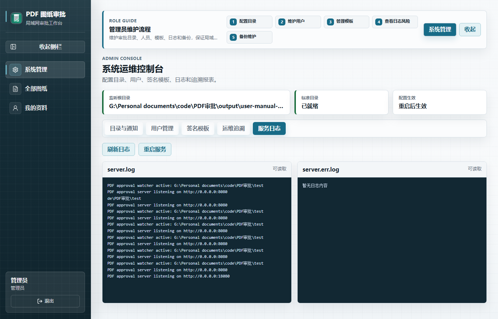

排障时优先查看：

- 服务启动是否成功。
- 审批根目录监听是否正常。
- 文件扫描是否报错。
- PDF 是否无效。
- 签后 PDF 生成是否失败。
- 邮件通知是否发送失败。
- 更新清单是否 404。

日志会持续记录，管理员应结合时间筛选，不要只看页面最底部。

### 8.7 全部图纸和删除图纸

管理员在“全部图纸”中可以：

- 按关键词、状态、项目筛选图纸。
- 查看审批详情。
- 处理 PDF 无效、文件丢失、签名失败等异常。
- 单个删除图纸。
- 批量删除图纸。

删除规则：

- 删除会清理审批记录、签名框、评论、批注、原始 PDF、流转 PDF 和签后 PDF。
- 如果项目文件夹被清空，系统会尝试删除空项目文件夹。
- 删除不可用于替代正常归档；只有误提交、测试数据、异常数据才建议删除。

删除前建议确认图纸不再需要追溯。

## 9. 目录提交兜底方式

除网页上传外，系统仍保留目录投递方式。

设计师可把 PDF 放入：

```text
审批根目录\01-待提交\项目名\零件名-a0A0.pdf
```

也支持根目录直接放入：

```text
审批根目录\零件名-a0A0.pdf
```

根目录直接放入时，系统会归入默认项目。

注意：

- 目录提交无法在提交瞬间设置签名框。
- 需要设计师或管理员后续进入详情页补齐设计、主管、工艺三个签名框。
- 若主管和工艺已经通过，保存签名框后系统会尝试立即生成签后 PDF。
- 如坚果云同步较慢，可在管理端点击“立即重新扫描”。

日常正式使用优先网页上传。

## 10. 通知提醒

系统支持网页待办、客户端提醒和邮件提醒。

不同角色常见提醒：

- 设计师：图纸被驳回、审核通过待打印、签名失败、批注问题待处理。
- 主管：有新图纸待主管审核。
- 工艺：有新图纸待工艺审核。
- 管理员：系统风险、签名失败、目录异常、备份或扫描异常。

如果收不到邮件：

1. 检查个人资料里的邮箱是否正确。
2. 给自己发送测试邮件。
3. 联系管理员检查 SMTP 配置。
4. 检查垃圾邮件或公司邮箱拦截。

## 11. 常见问题

### 11.1 无法连接服务端

处理顺序：

1. 确认服务端电脑已开机。
2. 确认服务端应用正在运行。
3. 使用服务端窗口显示的局域网地址，不要使用 `127.0.0.1`。
4. 在客户端点击“连接自检”。
5. 让管理员检查 Windows 防火墙是否放行服务端端口。

### 11.2 上传后 PDF 预览失败

常见原因：

- 文件不是有效 PDF。
- 坚果云或网络同步未完成。
- PDF 文件损坏。
- 文件名和版本解析异常。
- 服务端无法读取审批根目录。

处理方式：

1. 重新从 CAD 或制图软件导出 PDF。
2. 确认本地可以用 PDF 阅读器打开。
3. 重新上传。
4. 仍失败时联系管理员查看服务日志。

### 11.3 签后 PDF 没有生成

处理顺序：

1. 打开审批详情查看签名状态。
2. 确认设计师、主管、工艺都已配置签名。
3. 确认三个签名框都已放置。
4. 确认主管和工艺都已通过。
5. 确认原始 PDF 未丢失。
6. 修复后点击“重新生成签后 PDF”。

### 11.4 签名位置不对

设计师打开详情页：

1. 点击编辑签名框。
2. 拖动签名框到正确位置。
3. 调整大小。
4. 保存位置。
5. 点击“重新生成签后 PDF”。
6. 打开新签后 PDF 检查。

### 11.5 审查版 PDF 和签后 PDF 有什么区别

| 文件 | 用途 | 包含内容 |
| --- | --- | --- |
| 审查版 PDF | 审核问题归档、沟通复核 | 原图纸 + 图纸批注 |
| 签后 PDF | 正式打印归档 | 原图纸 + 三方手写签名 |

正式打印优先使用签后 PDF。

### 11.6 标注后想回到初始版本

在审批详情中使用“回退到初始版”或“回退批注”相关按钮，可清理当前图纸上的审核批注，恢复到未标注状态。回退前请确认批注不再需要保留。

### 11.7 客户端不提示更新

可能原因：

- 服务端没有同步最新 `releases` 更新目录。
- 客户端已经是最新版。
- 当前登录地址不是正式服务端地址。
- 服务端 `/updates/latest.json` 或 `/updates/latest.yml` 返回 404。

处理方式：

1. 重新登录客户端。
2. 确认连接的是正式服务端 IP。
3. 联系管理员在运维追溯中检查版本更新。
4. 管理员确认服务端安装目录下存在 `releases\updates\latest.json`、`latest.yml` 和客户端安装包。

### 11.8 目录不是坚果云目录，同事还能上传吗

可以。网页上传是把 PDF 上传到服务端，再由服务端写入管理员配置的审批根目录。同事电脑不需要直接访问这个目录。

但如果团队还要使用“把文件放入文件夹自动提交”的方式，或者希望坚果云同步审批文件，就应把审批根目录设置为坚果云同步目录。

## 12. 每日使用建议

设计师：

1. 确认自己已配置签名。
2. 上传前检查文件名和版本。
3. 提交时逐张确认签名框位置。
4. 被驳回后按原因修改并提交新版本。
5. 通过后打印签后 PDF 并标记归档。

主管：

1. 每天打开“待我审核”。
2. 审核时优先使用图纸批注标明位置。
3. 驳回时写清楚修改原因。
4. 通过前检查签名框位置是否合理。

工艺：

1. 每天查看“待我审核”。
2. 重点检查加工、检测、材料、技术要求和版本变化。
3. 需要修改时用批注和评论说清楚。
4. 无问题后通过。

管理员：

1. 查看风险看板和服务日志。
2. 确认目录、写入权限、扫描和备份正常。
3. 维护用户和邮箱。
4. 处理签名失败、文件丢失、PDF 无效等异常。
5. 发布新版前备份数据库。

## 13. 上线前检查清单

管理员在团队正式启用前应完成：

- 服务端安装在固定电脑上。
- 服务端显示真实局域网地址。
- Windows 防火墙已放行服务端端口。
- 客户端能通过局域网地址连接。
- 审批根目录已设置。
- 标准目录已创建。
- 默认账号密码已修改。
- 设计师、主管、工艺账号已创建。
- 设计师、主管、工艺都已配置签名。
- 邮箱通知已测试。
- 用一张真实图纸完成完整流程：
  1. 设计师上传。
  2. 放置三个签名框。
  3. 主管通过。
  4. 工艺通过。
  5. 自动生成签后 PDF。
  6. 设计师打印归档。
- 用多张图纸完成一次批量上传测试。
- 备份功能已验证。
- 更新面板能看到当前版本。

## 14. 管理员交付给同事的信息模板

管理员可以把下面内容发给团队成员：

```text
PDF 图纸审批系统已启用。

客户端安装包：请使用管理员发放的 PDF图纸审批客户端-安装包-0.9.2.exe
服务器地址：http://服务器IP:8080

首次使用：
1. 安装并打开客户端。
2. 填写服务器地址并连接。
3. 使用自己的账号登录。
4. 进入“我的资料”确认姓名和邮箱。
5. 设计师、主管、工艺必须进入“我的签名”配置签名。

设计师上传文件命名建议：零件名-a0A0.pdf
有问题请先截图页面提示，再联系管理员。
```

